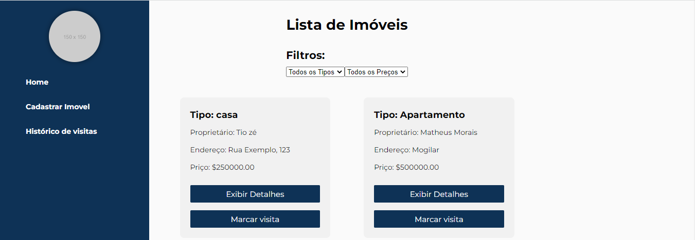
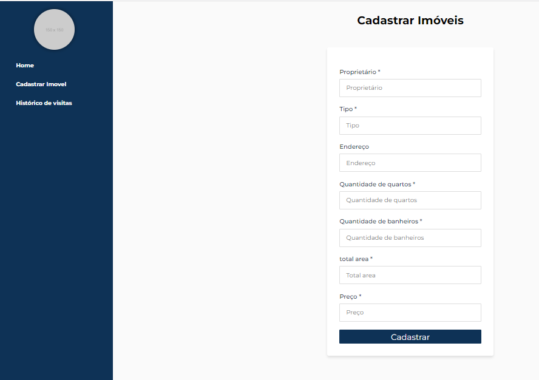
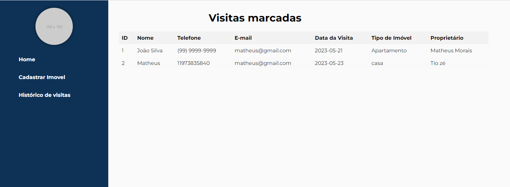

    
 

 

    
 

 

    
 

 
## Documentação
    Immobile API (Construída com Laravel)

    Registrar Usuário
    Endpoint para registrar um novo usuário:

    URL: /api/register
    Método: POST
    Corpo da solicitação:
    {
    "name": "Nome do usuário",
    "email": "exemplo@dominio.com",
    "password": "senha"
    }
    Resposta de sucesso:
    {
     "message": "User registered successfully"
    }

    Login
    Endpoint para fazer login e obter um token de acesso:

    URL: /api/login
    Método: POST
    Corpo da solicitação:
    {
    "email": "exemplo@dominio.com",
    "password": "senha"
    }
    Resposta de sucesso:
    {
    "user": {
        "id": 1,
        "name": "Nome do usuário",
        "email": "exemplo@dominio.com",
        "created_at": "2023-05-22T12:00:00Z",
        "updated_at": "2023-05-22T12:00:00Z"
    },
    "access_token": "token_de_acesso"
    }
    Obter Usuários
    Endpoint para obter todos os usuários:

    URL: /api/users
    Método: GET
    Cabeçalho da solicitação:
    Chave: Authorization
    Valor: Bearer token_de_acesso
    Resposta de sucesso:
    {
    "users": [
        {
        "id": 1,
        "name": "Nome do usuário",
        "email": "exemplo@dominio.com",
        "created_at": "2023-05-22T12:00:00Z",
        "updated_at": "2023-05-22T12:00:00Z"
        },
        
    ]
    }
    Criar imóvel
    URL: /api/immobiles
    Método: POST
    Descrição: Cria um novo imóvel com base nos dados fornecidos.
    Parâmetros:
    owner: (string, obrigatório) Nome do proprietário do imóvel.
    type: (string, obrigatório) Tipo do imóvel.
    address: (string, obrigatório) Endereço do imóvel.
    bedrooms: (integer, obrigatório) Número de quartos do imóvel.
    bathrooms: (integer, obrigatório) Número de banheiros do imóvel.
    total_area: (numeric, obrigatório) Área total do imóvel.
    price: (numeric, obrigatório) Preço do imóvel.
    Resposta de Sucesso: Retorna os dados do imóvel criado com o código de status 201 (Created).

    Atualizar imóvel
    URL: /api/immobiles/{id}
    Método: PUT
    Descrição: Atualiza um imóvel existente com base no ID fornecido.
    Parâmetros:
    id: (integer, obrigatório) ID do imóvel a ser atualizado.
    owner: (string, obrigatório) Nome do proprietário do imóvel.
    type: (string, obrigatório) Tipo do imóvel.
    address: (string, obrigatório) Endereço do imóvel.
    bedrooms: (integer, obrigatório) Número de quartos do imóvel.
    bathrooms: (integer, obrigatório) Número de banheiros do imóvel.
    total_area: (numeric, obrigatório) Área total do imóvel.
    price: (numeric, obrigatório) Preço do imóvel.
    Resposta de Sucesso: Retorna os dados do imóvel atualizado com o código de status 200 (OK).

    Excluir imóvel
    URL: /api/immobiles/{id}
    Método: DELETE
    Descrição: Exclui um imóvel existente com base no ID fornecido.
    Parâmetros:
    id: (integer, obrigatório) ID do imóvel a ser excluído.
    Resposta de Sucesso: Retorna uma mensagem de sucesso com o código de status 200 (OK).

    Obter imóvel
    URL: /api/immobiles/{id}
    Método: GET
    Descrição: Obtém os detalhes de um imóvel existente com base no ID fornecido.
    Parâmetros:
    id: (integer, obrigatório) ID do imóvel a ser obtido.
    Resposta de Sucesso: Retorna os dados do imóvel com o código de status 200 (OK).

    Listar imóveis
    URL: /api/immobiles
    Método: GET
    Descrição: Lista todos os imóveis cadastrados.
    Resposta de Sucesso: Retorna uma lista de imóveis com o código de status 200 (OK).
    
    Marcar visita
    URL: /api/immobiles/{id}/mark-visit
    Método: POST
    Descrição: Marca uma visita para um imóvel específico com base no ID fornecido.
    Parâmetros:
    id: (integer, obrigatório) ID do imóvel para marcar

## Tecnologias utilizadas

    Laravel
    MYSQL
    ReactJS

## Configuração do .env

   DB_CONNECTION=mysql
   DB_HOST=127.0.0.1
   DB_PORT=3306
   DB_DATABASE=corretoron
   DB_USERNAME=root
   DB_PASSWORD=

## OBS: Na raiz do projeto back-end estou enviando a documentação do thunder-client que utilizei para criar os endpoints.

